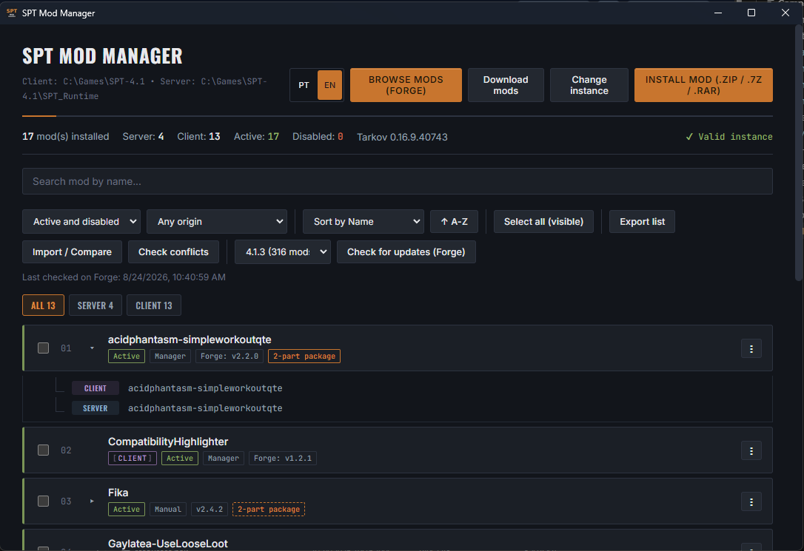

# SPT (Single Player Tarkov) Setup Guide

Setup guide to getting SPT (Single Player Tarkov) **v4.1.3** and **Fika v2.4.2** running on your machine. 

## Prerequisites 

All required installers and runtimes can be found under [**Releases**](https://github.com/mikematos84/spt-setup-guide/releases).

### Runtimes

- DotNet 10 Desktop Runtime v10.0.11
- ASP.NET 10 Core Runtime v10.0.11

### Installers

- Battlestate Games Launcher v15.0.0.4595
- SPT Installer v4.1.3
- Fika Installer v2.4.2

> **Download files from the [Releases](https://github.com/mikematos84/spt-setup-guide/releases) page:**
> - **v1.0.0**: Download all 5 base setup files (runtimes + installers). Extract into a `downloads` folder before starting setup.
> - **v1.0.0-mods** (Optional): Quality-of-Life Mods Bundle - download for recommended mods (see Step 8).

## Steps

### Step 1: Install Runtimes
If not already installed, install the [DotNet 10 Desktop Runtime](./downloads/windowsdesktop-runtime-10.0.11-win-x64.exe) and [ASP.NET 10 Core Runtime](./downloads/aspnetcore-runtime-10.0.11-win-x64.exe)

### Step 2: Install Battlestate Games Launcher
Launch the **Battlestate Games Launcher** and follow the installation prompts leaving all the **default settings**. 
> The default installation path should be `C:\Battlestate Games\BsgLauncher`

### Step 3: Install Escape from Tarkov
Launch the **Battlestate Game Launcher**, login, and install Escape From Tarkov. 
> Default installation path should be `C:\Battlestate Games\Escape from Tarkov`

### Step 4: Install SPT
Create a `C:\Games\SPT` directory and **copy** the **SPTInstaller.exe** from the **downloads** folder into that directory. Then, launch the **SPTInstaller.exe** from that directory, stepping through the prompts and leaving all the **default settings**

### Step 5: SPT (Pre-Fika) Setup

The following are steps you have to take in order to be ready to install Fika. It relies on files that are created by SPT when you run the server and play a game. 

1. Click **SPT.Server** and wait for it to say **Server has started, happy playing**
1. Click **SPT.Launcher** 
1. Click on the **Local Server** tile to connect to it. 
1. Click the **CREATE NEW PROFILE** button to create a profile.
   - Edition: Any one is fine
   - Name: `Test_SPT_User`
1. Click the `Test_SPT_User` Profile 
1. Click **START GAME** at the top right corner
1. Click **NEXT** on the character selection screen (you can simply pick any character and proceed)
1. Play a raid or Scav run to completion (whether you survive or die, the necessary files will be created)
1. Exit the game
1. Exit the launcher
1. Exit the terminal window for **SPT.Server** to shutdown the server

### Step 6: Install Fika 

1. **Copy** the **Fika-Installer.exe** to the `C:\Games\SPT` directory
1. Launch the **Fika-Installer.exe**
1. Enter 1 for **[1] Install Fika**
1. Once its been installed, **Press any key to continue**
1. Exit the terminal window to close the Fika Installer

### Step 7: Restoring Profiles
1. Copy your previously downloaded profile to `C:\Games\SPT\SPT_Runtime\user\profiles`
1. Click **SPT.Server** to launch the local server again
   > You will see some information regard profile migration. This is normal.
1. Click **SPT.Launcher** 
1. Click on the **Local Server** tile to connect to it
1. You should now see your old profile as an option on the screen. 
1. Click the tile for your restore profile
1. Click **START GAME** and you should see your restore profile in-game

### Step 8: Installing Mods (Optional)

If you want to add recommended quality-of-life mods to your SPT installation:

1. Download the **Quality-of-Life Mods Bundle** from the [v1.0.0-mods Release](https://github.com/mikematos84/spt-setup-guide/releases/tag/v1.0.0-mods)
2. Download any or all of the 9 mod files from that release

**Option A: Direct Extract (Recommended)**
1. Right-click each mod file and select **Extract All**
1. In the extraction dialog, set the destination to: `C:\Games\SPT\`
1. Click **Extract** - the mod files will merge with existing directories (overwriting where necessary)

**Option B: Extract Then Copy**
1. Extract mod files to a temporary location (e.g., Desktop)
2. Open each extracted folder and copy all contents (BepInEx, SPT_Runtime, etc.)
3. Navigate to `C:\Games\SPT\` and paste - Windows will prompt to merge/overwrite, select **Yes**

**After Installation**
1. Restart your SPT server for mods to take effect
1. You can verify mods are loaded by checking the console output when the server starts

> **Note**: Only install mods that are compatible with SPT v4.1.3. Incompatible mods may cause crashes or unexpected behavior.

---

## 📋 Dependency Reference

This guide uses the following versions and sources. Use this section for troubleshooting or if you need to download files manually.

### Runtimes

| Component | Version | Download |
|-----------|---------|----------|
| **DotNet Desktop Runtime** | 10.0.11 | [https://builds.dotnet.microsoft.com/dotnet/WindowsDesktop/10.0.11/windowsdesktop-runtime-10.0.11-win-x64.exe](https://builds.dotnet.microsoft.com/dotnet/WindowsDesktop/10.0.11/windowsdesktop-runtime-10.0.11-win-x64.exe) |
| **ASP.NET Core Runtime** | 10.0.11 | [https://builds.dotnet.microsoft.com/dotnet/aspnetcore/Runtime/10.0.11/aspnetcore-runtime-10.0.11-win-x64.exe](https://builds.dotnet.microsoft.com/dotnet/aspnetcore/Runtime/10.0.11/aspnetcore-runtime-10.0.11-win-x64.exe) |

### Applications

| Component | Version | Download | Official Guide |
|-----------|---------|----------|-----------------|
| **Battlestate Games Launcher** | 15.0.0.4595 | [https://launcher.escapefromtarkov.com/launcher/download](https://launcher.escapefromtarkov.com/launcher/download) | — |
| **SPT (Single Player Tarkov)** | 4.1.3 | [https://patcher.sp-tushonka.com/SPTInstaller.exe](https://patcher.sp-tushonka.com/SPTInstaller.exe) | [SPT 4.x Installation Guide](https://wiki.sp-tushonka.com/en/SPT_4x/Installation_Guide) |
| **Fika (Multiplayer Mod)** | 2.4.2 | [https://github.com/project-fika/Fika-Installer/releases/download/v1.2.0/Fika-Installer.exe](https://github.com/project-fika/Fika-Installer/releases/download/v1.2.0/Fika-Installer.exe) | [Fika Installation Guide](https://wiki.project-fika.com/installing-fika/installation) |

> **Note**: This guide is specifically tested with SPT v4.1.3 and Fika v2.4.2. If newer versions become available, refer to the official installation guides linked above for any changes to the setup process.

---

## 🎮 Recommended Mods

The following quality-of-life mods and utilities are included in the Release to enhance your SPT experience. See **Step 8: Installing Mods (Optional)** above for installation instructions.

### 🛠️ Utilities
Start with these tools to help manage your SPT installation and mods.

| Utility | Description | Version | Official Page | File |
|---------|-------------|---------|---|---|
| **SPT Mod Manager** | Open-source mod manager for SPT featuring easy installation, management, and Forge integration | 0.5.3 | https://sp-mod.com/mod/2851/spt-mod-manager | `SPT-Mod-Manager.zip` |

> **SPT Mod Manager Installation**: While this utility can be run from anywhere, we recommend creating a dedicated folder to keep things organized. Extract the `SPT-Mod-Manager.zip` contents to `C:\Games\SPT\SPT_Mod_Manager\` for easy access and management.

### Quality-of-Life Mods
These mods improve gameplay experience, convenience, and information accessibility without significantly altering core mechanics.

| Mod | Description | Version | Official Page | File |
|-----|-------------|---------|---|---|
| **DynamicMaps** | Interactive map markers, locations, and extract information | 1.2.1 | https://sp-mod.com/mod/1431/dynamic-maps | `DynamicMaps-1.2.1.zip` |
| **Task Search** | Quick search functionality for tasks and objectives | 4.1 | https://sp-mod.com/mod/2909/task-search | `TaskSearch4.1.zip` |
| **Compatibility Highlighter** | Shows item compatibility and equipment compatibility info | 1.2.1 | https://sp-mod.com/mod/2859/compatibility-highlighter | `CompatibilityHighlighterV1.2.1.7z` |
| **Climbable Ladders** | Makes ladders climbable for improved map navigation | 1.0.4 | https://sp-mod.com/mod/2649/climbable-ladders | `tarkin-ladders-v1.0.4.zip` |
| **Merge Consumables** | Groups similar consumable items together for inventory organization | 1.0 | https://sp-mod.com/mod/1657/mergeconsumables | `MergeConsumables.zip` |
| **Simple Workout QTE** | Simplifies workout quick-time events for ease of use | 1.0 | https://sp-mod.com/mod/1437/simple-workout-qte | `acidphantasm-simpleworkoutqte.7z` |
| **Use Loose Loot** | Allows using loose loot without picking it up | 1.6.0 | https://sp-mod.com/mod/933/use-loose-loot | `Gaylatea-UseLooseLoot-1.6.0.7z` |
| **Task Item Indicator** | Visually highlights items needed for active tasks | 1.0.0 | https://sp-mod.com/mod/2888/task-item-indicator | `TaskItemIndicator_1.0.0.zip` |
| **Fast Sell In Flea** | Quickly add items on the flea market with automatic fitting of the current price | 1.3.1 | https://sp-mod.com/mod/2207/fast-sell-in-flea | `Kat-FastSellInFlea-1.3.1.7z` |
| **Trader Search** | Filter trader stock live by item name with a search bar | 2.0.0 | https://sp-mod.com/mod/2824/tradersearch | `maschine-TraderSearch-2.0.0.zip` |
| **Linked Search In Stash** | Search your stash for items compatible with selected equipment | 2.0.1 | https://sp-mod.com/mod/2731/linkedsearchinstash | `maschine-LinkedSearchInStash-2.0.1.zip` |
| **Weapon Builder Search** | Live search functionality in the Weapon Builder and Modding screens | 2.0.0 | https://sp-mod.com/mod/2743/weaponbuildersearch | `maschine-WeaponBuilderSearch-2.0.0.zip` |
